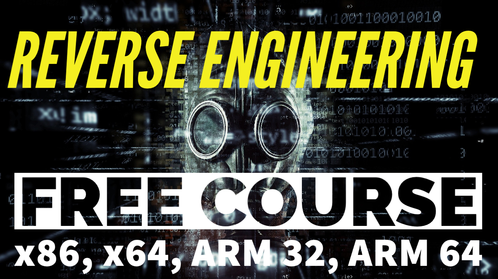

<h1 align="center">
    Reverse Engineering for Everyone!
</h1>

  
  

<h3>Wait what's reversing?</h3>

Wikipedia defines it as:
<blockquote>
    Reverse engineering, also called backwards engineering or back engineering, is the process by which an artificial object is deconstructed to reveal its designs, architecture, code, or to extract knowledge from the object. It is similar to scientific research, the only difference being that scientific research is conducted into a natural phenomenon.
</blockquote>
    Well that was quite a mouthful, wasn't it? Well, that is one of the main reasons why this tutorial set exists. To make reverse engineering
    <i>
        as simple as possible.
    </i>

    This comprehensive set of reverse engineering tutorials covering x86, x64 as well as 32-bit ARM and 64-bit. If you're a newbie looking to learn reversing, or an expert looking to revise on some concepts, you're at the right place.

<!---->
 

    The tutorial carries you from nothing upto the mid-basics of reverse engineering, a skill that everyone within the realm of cyber-security should possess.

 

    
        Created with ♡ by
        <a href="https://twitter.com/mytechnotalent">
            @mytechnotalent
        </a>
    

