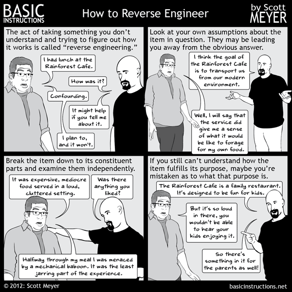

<h1 align="center">
    Reverse Engineering For Everyone!
</h1>

<h4 align="center">
    &mdash; by
    <a href="https://twitter.com/mytechnotalent">
        @mytechnotalent
    </a>
</h4>

    
        
    

<h3>
    Wait, what's reversing?
</h3>

    Wikipedia defines it as:
    <blockquote>
        Reverse engineering, also called backwards engineering or back engineering, is the process by which an artificial object is deconstructed to reveal its designs, architecture, code, or to extract knowledge from the object. It is similar to scientific research, the only difference being that scientific research is conducted into a natural phenomenon.
    </blockquote>
        Whew, that was quite a mouthful, wasn't it? Well, it is one of the main reasons why this tutorial set exists. To make reverse engineering
        <i>
            as simple as possible.
        </i>

    

    This comprehensive set of reverse engineering tutorials covers x86, x64 as well as 32-bit ARM and 64-bit architectures. If you're a newbie looking to learn reversing, or just someone looking to revise on some concepts, you're at the right place. As a beginner, these tutorials will carry you from nothing upto the mid-basics of reverse engineering, a skill that everyone within the realm of cyber-security should possess. If you're here just to refresh some concepts, you can conveniently use the side bar to take a look at the sections that has been covered so far.

 

    
        Site crafted with ♡ by
        <a href="https://twitter.com/0xInfection">
            @0xInfection
        </a>
    

